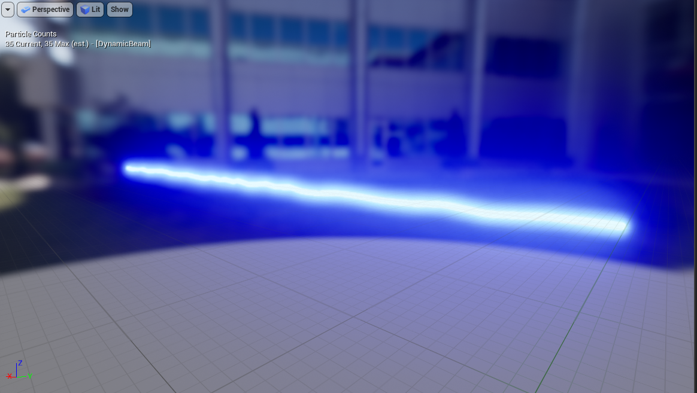

# Default Particles


**Note**: All Particles in this page are already included in the base game in the [Default nanos world Asset Pack](./), you can reference them like that: **`nanos-world::P_Beam`.**


## Template Particles

Bare minimum particles.

### `P_Beam`

This is a Niagara particle which joins two points with a Beam. Cool for creating Physics Guns or Laser effects.

| Parameter | Type | Default | Description |
| :--- | :--- | :--- | :--- |
| **`BeamColor`** | [Color](../../scripting-reference/utility-classes/color.md) | `Color(0, 0, 10, 1)` | Color of the Beam - multiply it to make it glow |
| **`BeamEnd`** | [Vector](../../scripting-reference/utility-classes/vector.md) | `Vector(0, 0, 0)` | World position of the second joint |
| **`BeamWidth`** | Float | `5.0` | Beam thickness |
| **`JitterAmount`** | Float | `0.1` | Amount of jitterness |

### `P_Ribbon`

This is a Niagara particle which makes a "trail" effect when moves.

| Parameter | Type | Default | Description |
| :--- | :--- | :--- | :--- |
| **`Color`** | [Color](../../scripting-reference/utility-classes/color.md) | `Color.WHITE` | Color - multiply it to make it glow |
| **`SpawnRate`** | Float | `100.0` | Rate of spawn the "ribbons" |
| **`Mass`** | Float | `10.0` | Mass of the "ribbons" |
| **`LifeTime`** | Float | `5.0` | How much time each "ribbon" will last |
| **`RibbonWidth`** | Float | `10.0` | The thickness of the Ribbon |

### `P_DirectionalBurst`

This is a Niagara particle which spawns a bunch of particles in a direction.

| Parameter | Type | Default | Description |
| :--- | :--- | :--- | :--- |
| **`Color`** | [Color](../../scripting-reference/utility-classes/color.md) | `Color.WHITE` | Color - multiply it to make it glow |
| **`SpawnCount`** | Float | `25.0` | Amount of Particles to spawn |
| **`VelocityStrengthMax`** | Float | `350.0` | Max velocity of the Particles |
| **`VelocityStrengthMin`** | Float | `125.0` | Min velocity of the Particles |

### `P_Fountain`

This is a Niagara particle which simulates a fountain.

| Parameter | Type | Default | Description |
| :--- | :--- | :--- | :--- |
| **`BeamColor`** | [Color](../../scripting-reference/utility-classes/color.md) | `Color.WHITE` | Color - multiply it to make it glow |
| **`SpawnRate`** | Float | `90.0` | Rate to spawn particles |
| **`VelocityStrengthMax`** | Float | `850.0` | Max velocity |
| **`VelocityStrengthMin`** | Float | `500.0` | Min velocity |

### `P_HangingParticulates`

This is a Niagara particle which makes a 3-dimentional "hanging particles" effect.

| Parameter | Type | Default | Description |
| :--- | :--- | :--- | :--- |
| **`Color`** | [Color](../../scripting-reference/utility-classes/color.md) | `Color.WHITE` | Color of the Particles |
| **`BoxSize`** | [Vector](../../scripting-reference/utility-classes/vector.md) | `Vector(400, 400, 100)` | 3D Size to spawn the Particles |
| **`SpawnRate`** | Float | `50.0` | Rate of spawn |

### `P_OmnidirectionalBurst`

This is a Niagara particle which makes a "explosion" effect in all directions.

| Parameter | Type | Default | Description |
| :--- | :--- | :--- | :--- |
| **`Color`** | [Color](../../scripting-reference/utility-classes/color.md) | `Color.WHITE` | Color - multiply it to make it glow |
| **`SpawnCount`** | Float | `50.0` | Amount of Particles to spawn |
| **`SphereRadius`** | Float | `10.0` | Radius to spawn the particles |
| **`VelocityStrengthMax`** | Float | `300.0` | Max velocity of the Particles |
| **`VelocityStrengthMin`** | Float | `75.0` | Min velocity of the Particles |

