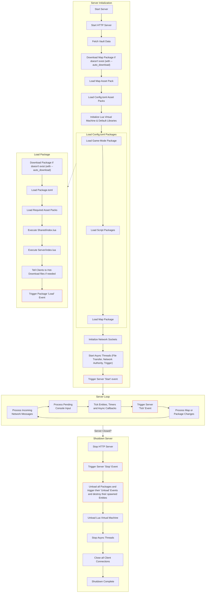
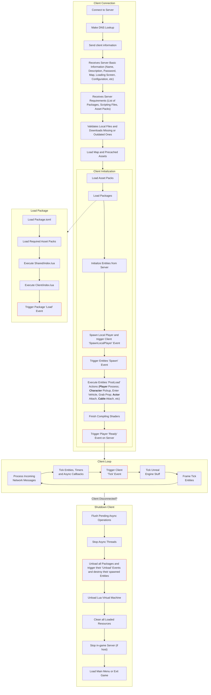

How nanos world framework works

## Server Lifecycle

```mermaid
flowchart TB
    classDef event stroke:#e74c3c

	subgraph ServerInitialization["Server Initialization"]
		direction TB
		StartServer["Start Server"]
		--> StartHTTPServer["Start HTTP Server"]
		--> FetchVault["Fetch Vault Data"]
		--> DownloadMapPackage["Download Map Package if doesn't exist (with --auto_download)"]
		--> LoadMapAssetPack["Load Map Asset Pack"]
		--> LoadConfigAssets["Load Config.toml Asset Packs"]
		--> InitializeScriptingEngine["Initialize Lua Virtual Machine & Default Libraries"]
		--> LoadPackages

		subgraph LoadPackages["Load Config.toml Packages"]
			direction TB
			LoadGameModePackage["Load Game-Mode Package"]
			--> LoadScriptPackages["Load Script Packages"]
			--> LoadMapPackage["Load Map Package"]
		end

		LoadMapPackage --> InitializeNetwork["Initialize Network Sockets"]
		--> InitializeAsyncThreads["Start Async Threads (File Transfer, Network Authority, Trigger)"]
		--> TriggerServerOnStartEvent["Trigger Server 'Start' event"]:::event
	end

	LoadPackages -.-> LoadPackage
	subgraph LoadPackage["Load Package"]
		direction TB
		DownloadPackage["Download Package if doesn't exist (with --auto_download)"]
		--> LoadPackageToml["Load Package.toml"]
		--> LoadPackageAssetPacks["Load Required Asset Packs"]
		--> LoadSharedIndex["Execute Shared/index.lua"]
		--> LoadServerIndex["Execute Server/index.lua"]
		--> TellClientsToHotDownload["Tell Clients to Hot-Download files if needed"]
		--> TriggerOnLoadEvent["Trigger Package 'Load' Event"]:::event
	end

	TriggerServerOnStartEvent --> ServerLoop
	subgraph ServerLoop["Server Loop"]
		direction LR
		ProcessIncomingNetworkMessages["`Process Incoming
		Network Messages`"]
		--> ProcessConsoleInput["`Process Pending
		Console Input`"]
		--> TickEntities["`Tick Entities, Timers
		and Async Callbacks`"]
		--> TriggerServerOnTickEvent["`Trigger Server
		'Tick' Event`"]:::event
		--> ProcessMapOrPackageChanges["`Process Map or
		Package Changes`"]
		--> ProcessIncomingNetworkMessages
	end

	ServerLoop --Server Closed?--> ShutdownServer
	subgraph ShutdownServer["Shutdown Server"]
		direction TB
		StopHTTPServer["Stop HTTP Server"]
		--> TriggerServerOnStopEvent["Trigger Server 'Stop' Event"]:::event
		--> UnloadAllPackages["Unload all Packages and trigger their 'Unload' Events and destroy their spawned Entities"]:::event
		--> UnloadLuaVirtualMachine["Unload Lua Virtual Machine"]
		--> StopAsyncThreads["Stop Async Threads"]
		--> CloseAllConnections["Close all Client Connections"]
		--> ShutdownComplete["Shutdown Complete"]
	end
```

## Client Lifecycle

```mermaid
flowchart TD
    classDef event stroke:#e74c3c

	subgraph Connection["Client Connection"]
		direction TB
		Connect["Connect to Server"]
		--> MakeDNSLookup["Make DNS Lookup"]
		--> SendWhoIs["Send client information"]
		--> ReceivesServerInformation["Receives Server Basic Information (Name, Description, Password, Map, Loading Screen, Configuration, etc)"]
		--> ReceivesServerRequirements["Receives Server Requirements (List of Packages, Scripting Files, Asset Packs)"]
		--> ValidatesLocalFiles["Validates Local Files and Downloads Missing or Outdated Ones"]
		--> LoadMapAndPrecachedAssets["Load Map and Precached Assets"]
		--> Initialization
	end

	subgraph Initialization["Client Initialization"]
		direction TB
		LoadAssetPacks["Load Asset Packs"]
		--> LoadPackages["Load Packages"]
		--> InitializeEntitiesFromServer["Initialize Entities from Server"]
		--> SpawnLocalPlayer["Spawn Local Player and trigger Client 'SpawnLocalPlayer' Event"]:::event
		--> TriggerEntitiesSpawnedEvent["Trigger Entities 'Spawn' Event"]:::event
		--> ExecuteEntitiesPostLoad["`Execute Entities 'PostLoad' Actions (**Player** Possess; **Character** Pickup, Enter Vehicle, Grab Prop; **Actor** Attach, **Cable** Attach, etc)`"]
		--> CompileShaders["Finish Compiling Shaders"]
		--> TriggerServerPlayerReadyEvent["Trigger Player 'Ready' Event on Server"]:::event
	end

	LoadPackages -.-> LoadPackage
	subgraph LoadPackage["Load Package"]
		direction TB
		LoadPackageToml["Load Package.toml"]
		--> LoadPackageAssetPacks["Load Required Asset Packs"]
		--> LoadSharedIndex["Execute Shared/index.lua"]
		--> LoadClientIndex["Execute Client/index.lua"]
		--> TriggerOnLoadEvent["Trigger Package 'Load' Event"]:::event
	end

	TriggerServerPlayerReadyEvent --> ClientLoop
	subgraph ClientLoop["Client Loop"]
		direction LR
		ProcessIncomingNetworkMessages["`Process Incoming
		Network Messages`"]
		--> TickEntities["`Tick Entities, Timers
		and Async Callbacks`"]
		--> TriggerServerOnTickEvent["`Trigger Client
		'Tick' Event`"]:::event
		--> UnrealTick["`Tick Unreal
		Engine Stuff`"]
		--> TickFrameEntities["`Frame Tick
		Entities`"]
		--> ProcessIncomingNetworkMessages
	end

	ClientLoop --Client Disconnected?--> ShutdownClient
	subgraph ShutdownClient["Shutdown Client"]
		direction TB
		FlushAnyAsyncLoad["Flush Pending Async Operations"]
		--> StopAsyncThreads["Stop Async Threads"]
		--> UnloadAllPackages["Unload all Packages and trigger their 'Unload' Events and destroy their spawned Entities"]:::event
		--> UnloadLuaVirtualMachine["Unload Lua Virtual Machine"]
		--> CleanUp["Clean all Loaded Resources"]
		--> StopInGameServers["Stop in-game Server (if host)"]
		--> ShutdownComplete["Load Main Menu or Exit Game"]
	end
```