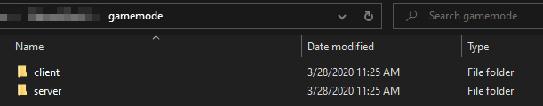

How to
===============

How to download the game
************************

To be able to download the game you have to be in the testing groups or have bought the game

#. Download `itch.io <https://itch.io/app>`_ launcher

#. Once you have it installed, create an Itch account

#. Go to the link we gave you and add the password on it

#. Congrats you have access to the itch.io private page of NanosWorld

#. Select the client you want(Be careful ! There are multiple client available during the testing phase)

.. image:: ./images/HowToDownload.png
   :width: 600
   :alt: Overview of the launcher

How to launch the game
**********************

#. After you have downloaded the game go into the created folder

#. Click on NanosWorld.exe

.. image:: ./images/HowToLaunchTheGame.png
   :width: 600
   :alt: Overview of the game folder

How to join a server
********************

#. Click on the play button and select the desired server

the server list is ranked this way:

Server-name, server-Gamemode, server-Maps, server-slot, server-ping

How to make a server
********************

#. After downloading the server file

#. Go into the server folder, it will look like this:

.. image:: ./images/HowToLaunchTheServer.png
   :width: 400
   :alt: Overview of the Server folder

#. Press NanosworldServer.exe to launch the server.

How to modify a config server file
**********************************

.. image:: ./images/HowToModifyServerConfig.png
   :width: 600
   :alt: Overview of the Config file

How to add package to my server
*******************************

Download or make gamemode and put it into the package folder on your server

How to make my own package
**************************

Some prerequisite knowledge is required:

* Knowledge of Lua for scripting, or alternatively use our visual scripting tool

* Basic web design skills (HTML, CSS) as GUIs are HTML pages displayed by the Chromium Embedded Framework

.. tip:: For information on learning these prerequisite skills, see our page <to be created>

The first step is to create the necessary directory structure:

#. Create a folder that will house the gamemode, with a name of your choice.

#. Inside the gamemode folder, create ``client`` and ``server`` folders.

Your directory structure should now look like this:

The next step is to create the necessary files inside of those folders:

#. Create an ``index.lua`` inside both the ``client`` and ``server`` folders.
#. <placeholder for any metadata files>

Now you're ready to start writing code for your package! If you wish to include any other Lua file, you may use the following statement: ::

> Package.Require("another_folder/example.lua")

Lua functions from server-side packages can be called not only from scripts in the package itself, but also from the server console. ::

> package run package_name function_name

How to report a bug
*******************

If you find a bug:

#. go on `gitlab <https://gitlab2.nanos.io/>`_

#. Create a new account if you don't have one

#. Find the repo call NanosWorld/Issues or use this link: `Issue Tracker <https://gitlab2.nanos.io/nanos.world/issues>`_

.. image:: ./images/issue.png
   :width: 200
   :alt: Repo for Issues

#. Click on it and then check the left UI and click on Issues

.. image:: ./images/issue2.png
   :width: 200
   :alt: Tab for issue

#. Click on a New issue on the right side and use the template to make your report(don't forget to add pictures and video with good explanation)

How to contribute to the docs
*****************************

This docs is made with `Sphinx (reStructuredText - RST) <https://en.wikipedia.org/wiki/ReStructuredText>`_. To be able to contribute and suggest changes, you need to clone the repository locally and have the following dependencies installed:

#. `nanos.world Documentation repository <https://github.com/nanos-world/docs>`_.

#. `Python <https://www.python.org/downloads/>`_.

#. Sphynx: ``pip install -U Sphinx``.

#. Sphynx extension sphinx-tabs: ``pip install sphinx-tabs``.

Once you have it all installed, you can edit .rst files and create pull requests for your changes be accepted and included in the main docs ;).

#. To compile and visualize what you have edited, run on cmd: ``make html``, the output files will be located at a _build folder.
