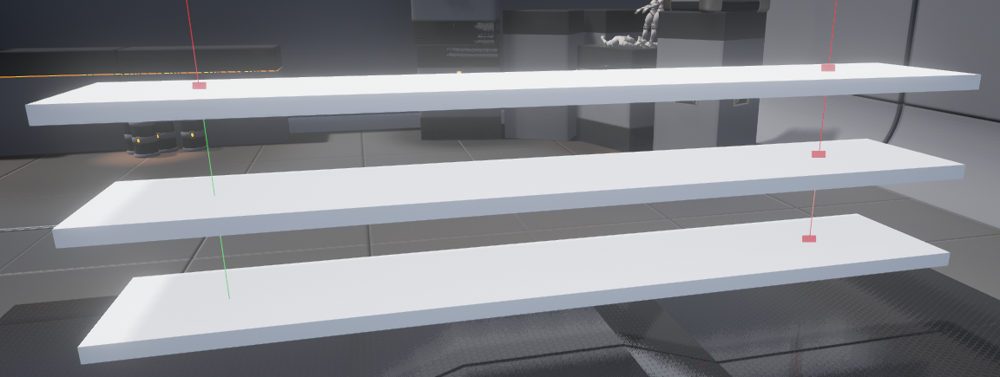

.. _TracesRaycasting:

*******************
Traces / Raycasting
*******************

**Traces** offer a method for reaching out in your maps and getting feedback on what is present along a line segment. You use them by providing two end points (a start and end location) and the physics system "traces" a line segment between those points, reporting any Actors that it hits. Traces are essentially the same as **Raycasts** or **Raytraces** in other software packages. 

.. tip:: The current Trace implementation will trace for any visible thing in the world. More options will come soon.

The following example will show you how to get what and where the player is looking at.

.. raw:: html

    <video controls src="https://i.imgur.com/7iGhd9r.mp4" width="100%"></video>  

.. note:: The following code runs on Client.

.. tabs::
 .. code-tab:: lua Lua

    -- Traces at each 100ms
    Timer:SetTimeout(100, function()
        -- Gets the middle of the screen
        local viewport_2D_center = Render:GetViewportSize() / 2

        -- Deprojects to get the 3D Location for the middle of the screen
        local viewport_3D = Render:Deproject(viewport_2D_center)

        -- Makes a trace with the 3D Location and it's direction multiplied by 5000
        -- Meaning it will trace 5000 units in that direction
        local trace_max_distance = 5000

        local start_location = viewport_3D.Position
        local end_location = viewport_3D.Position + viewport_3D.Direction * trace_max_distance

        -- Last parameter as true means it will draw a Debug Line in the traced segment
        local trace_result = Client:Trace(start_location, end_location, CollisionChannel.WorldStatic | CollisionChannel.PhysicsBody, false, true, false, true)

        -- If hit something draws a Debug Point at the location
        if (trace_result.Success) then

            -- Makes the point Red or Green if hit an Actor
            local color = Color(1, 0, 0) -- Red

            if (trace_result.Entity) then
                color = Color(0, 1, 0) -- Green

                -- Here you can check which actor you hit like
                -- if (trace_result.Entity:GetType() == "Character") then ...
            end

            -- Draws a Debug Point at the Hit location for 3 seconds with tickness 1
            Client:DrawDebugPoint(trace_result.Location, color, 3, 1)
        end
    end)

.. tip:: As you could see, we can pass bit-wise operators to Trace for more than one CollisionChannel at once! Use ``|`` between the CollisionChannels to achieve that.