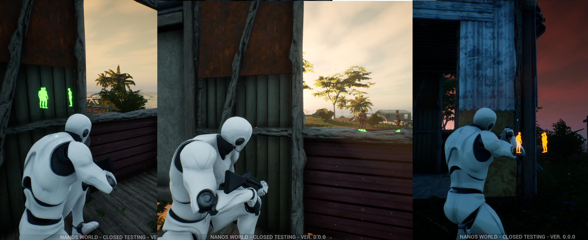

.. _XRay:

*****************
X-Ray / Highlight
*****************

This sample code shows how to set Actors to be highlighted when behind walls, or always highlighted!

.. note:: Currently it's only possible to have one color for all Highlighted objects.

.. tip:: As highlighting is something calculed in Post Processing, it is really hard to define custom colors for individual entities. Fortunately nanos world supports having 3 different colors which you can configure with ``Client:SetHighlightColor(highlight_color, index)``, and then enabled it in the Actor with ``character:SetHighlightEnabled(true, index)``. Valid indexes are 0, 1 and 2. 

.. note:: The following code runs on Client.

.. tabs::
 .. code-tab:: lua Lua
    
    -- Sets the Global desired Highlight color
    -- Note: Alpha from 0-1 will only appear if visible
    --       Alpha from 1-2 will appear even if behind a wall or other objects
    -- Higher color values make it glow
    local highlight_color = Color(10, 2.5, 0, 1)
    Client:SetHighlightColor(highlight_color, 0)

    -- Setting all Characters to highlight
    Character:Subscribe("Spawn", function(character)
        character:SetHighlightEnabled(true, 0)
    end)